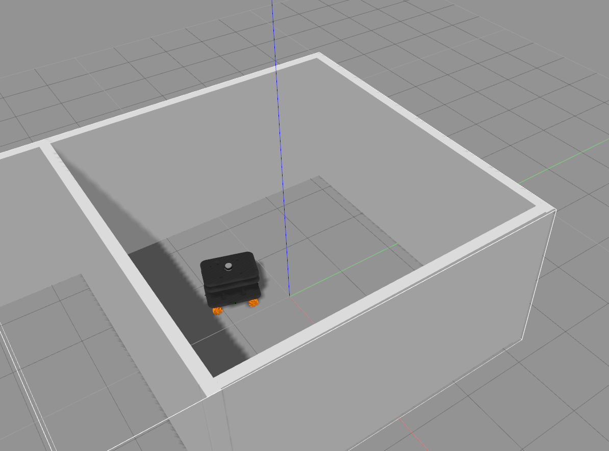

# dualarm_mobile_mservo

Dependencies

gazebo_ros_pkgs : http://wiki.ros.org/gazebo_ros_pkgs

velodyne : http://wiki.ros.org/velodyne_gazebo_plugins

dualarm_mobile_localizaion : kay01-kwon/dualarm_mobile_localization

dualarm_mobile_planner : kay01-kwon/dualarm_mobile_planner

Build

$ cm

Execution

1. Simulator

$ roslaunch mobile_platform_description gazebo_v1.launch

2. SLAM

$ roslaunch dualamr_mobile_localization gmapping.launch

3. Planner

$ roslaunch dualarm_mobile_planner teb_local_planner.launch

4. Controller

$ rosrun sim_control motor_dynamics

$ rosrun sim_control tracking_controller_prev

Click goal position or publish /move_base_simple/goal in a terminal

# dualarm_mobile_mservo
